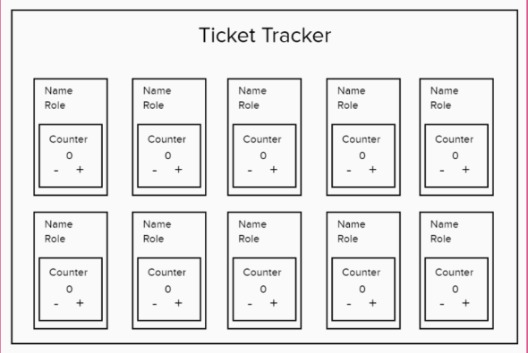

### Ticket Tracker Project
---

### Requirements
 1. Should be built in React + Typescript
 2. Each component should manage its own state
 3. The components should be generated using a map()

### Extension
 1. Add a search by name box
 2. Add a select by role dropdown box

### Plan
 Create the components you think you will need (at least an employee component, possibly more)
 Map over the data file below to create the components
 Pass data into them via props
 Use State to handle the increment and decrement of tickets
 Style it however you like, but don’t leave it blank
 Should work on mobile devices

### End goal product

